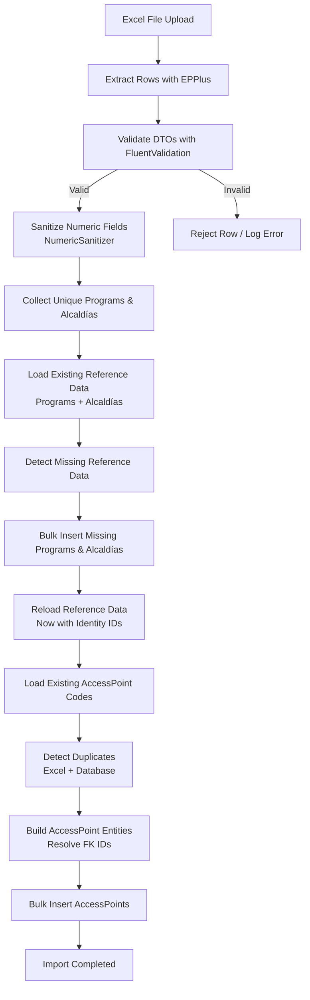
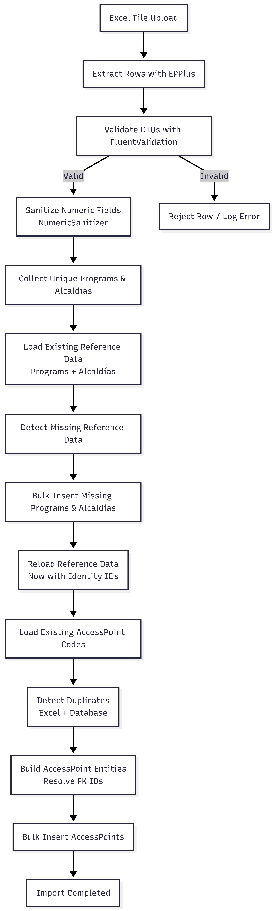
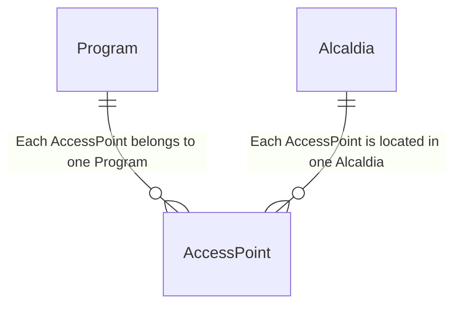
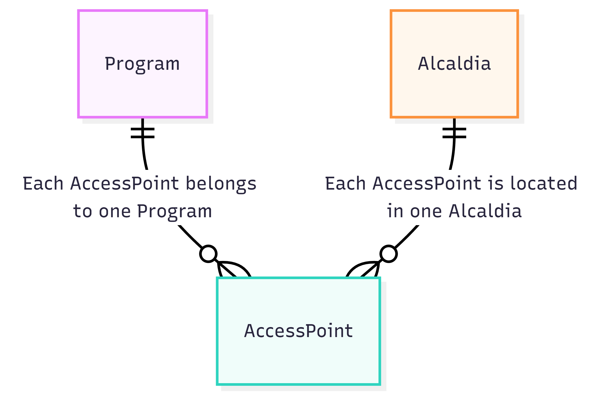
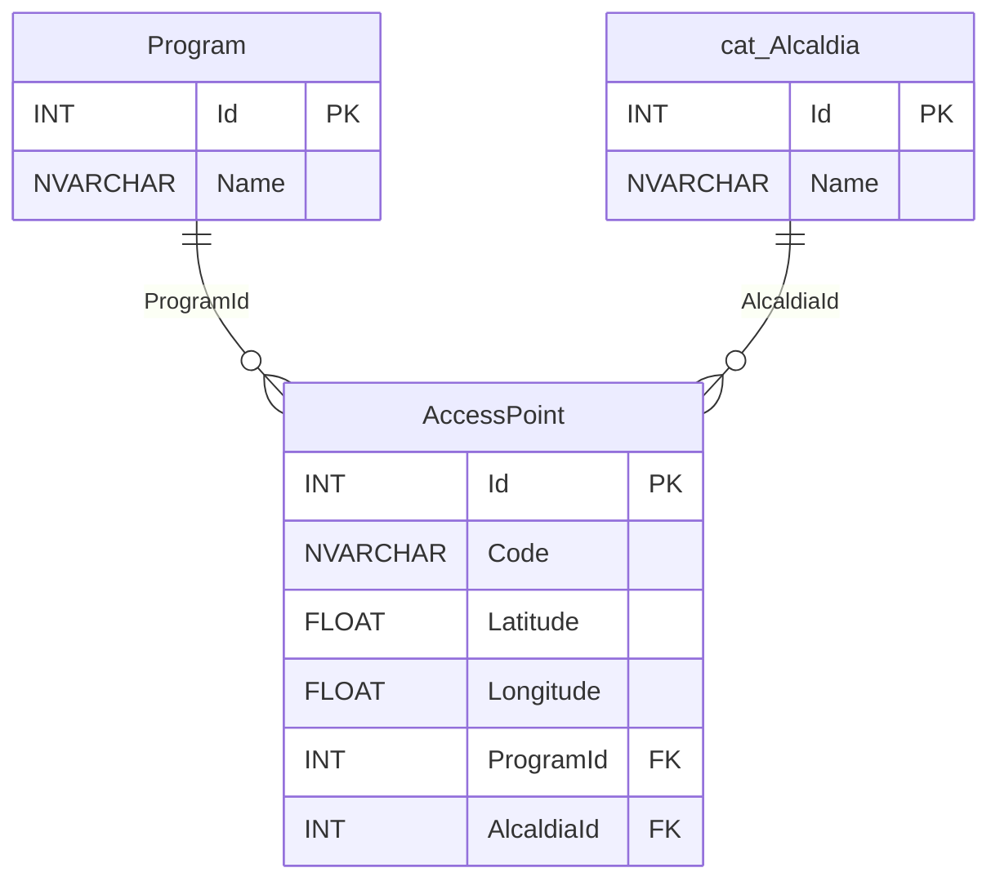
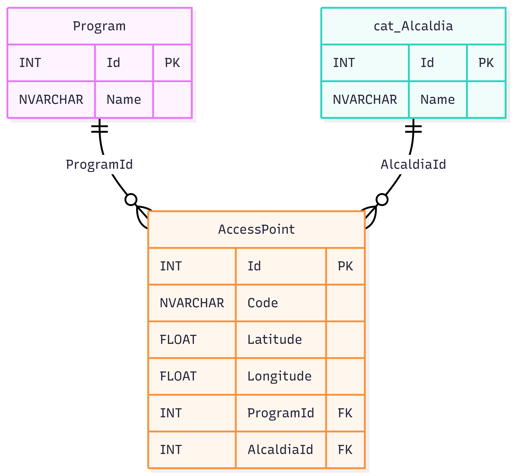

# Excel Import ETL Pipeline (.NET 8 / SQL Server)

## Overview
This project implements a high-performance ETL (Extract–Transform–Load) pipeline using .NET 10, ASP.NET Core Web API, and SQL Server. It imports large Excel files containing AccessPoint data, sanitizes and validates the content, resolves foreign keys, and performs optimized bulk inserts into the database. The system is designed for enterprise-scale workloads, handling messy real-world Excel files while maintaining data integrity, performance, and maintainability.

## ETL Flow Diagram

<p align="center">
    
</p>

## Conceptual ER diagram

<p align="center">
    
</p>

## Logical ER diagram

<p align="center">
    
</p>

## Import Workflow
1.  Extract Excel rows.
2.  Validate DTOs.
3.  Sanitize numeric values.
4.  Detect missing reference data.
5.  Bulk insert missing Programs and Alcaldías.
6.  Reload reference data.
7.  Detect duplicates (Excel and database).
8.  Build AccessPoint entities.
9.  Bulk insert AccessPoints.

## Features
* Extracts data from Excel using EPPlus.
* Validates each row using FluentValidation.
* Sanitizes numeric values using a dedicated NumericHelper.
* Deduplicates Programs, Alcaldías, and AccessPoints using HashSets.
* Resolves foreign keys in memory.
* Performs bulk inserts for Programs, Alcaldías, and AccessPoints.

## Architecture
* **API Layer**: Upload endpoint.
* **Service Layer**: ETL pipeline (ExcelImportService).
* **Repository Layer**: Bulk inserts and queries.
* **Domain Layer**: Entities (ProgramModel, AlcaldiaModel, AccessPointModel).
* **Infrastructure Layer**: EF Core and SQL Server.

## Technical Details

### Numeric Sanitization
Handles trailing commas, thousands separators, non-breaking spaces, hidden whitespace.

### Duplicate Handling example
**Inside Excel**
```csharp
var excelCodes = new HashSet<string>(StringComparer.OrdinalIgnoreCase);
if (!excelCodes.Add(dto.Code))
    continue;
```

**In the Database**
```csharp
var existingCodes = new HashSet<string>(
    await _uow.AccessPoints.GetAllCodesAsync(),
    StringComparer.OrdinalIgnoreCase
);
```

### Bulk Insert Strategy
Uses `SqlBulkCopy` for high-performance inserts.

### Validation
FluentValidation ensures required fields and valid numeric values.

### Error Handling
Provides descriptive exceptions for invalid numeric values.

## Technologies Used
* .NET 10
* SQL Server
* EF Core
* OpenAPI + Scalar
* EPPlus
* FluentValidation

## Author
**Miguel Neftali Ruiz Cauich**  
Creator and maintainer of WifiAccessPointsCDMX  
Senior Backend Developer (.NET / SQL Server)    
LinkedIn: https://www.linkedin.com/in/miguel-neftali-ruiz-cauich-3964aa236